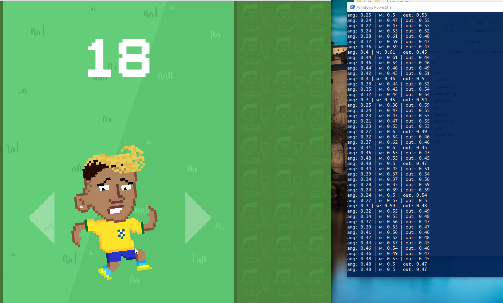

# neyboy-AI

AI learns how to play Neyboy game: <https://neyboy.com.br/>

## Introduction

This is a project used in one of my course ministrations. It's a simple implementation of an AI learning how to play by itself.
It uses a simple Neural Network with 2 inputs:

* Character angle from 0.0 to 1.0 (left: 0.0; right: 1.0);
* Character angle speed (negative speed: < 0.5; positive speed > 0.5);

To get those inputs, python will scan desktop screen to find the game using pixel's colors.
The result of the NN is an output from 0.0 to 1.0 that means:

* < 0.3: press left;
* \> 0.3 and < 0.7: do nothing;
* \> 0.7: press right;

It uses genetic algorithm to classify the best genome in a generation to evolute the network.

## How to run

First, you need to download the repository:

```bash
git clone https://github.com/rosostolato/neyboy-AI.git
```

Then install dependencies:

```bash
pip install Pillow
pip install numpy
pip install pynput
```

Now, open <https://neyboy.com.br/> in browser and make sure that the window is visible in screen.
And in a terminal run the following command:

```bash
python .\bot.py
```

P.S. To make it running automatically, just let you mouse over the play button and it will fire click automatically.


